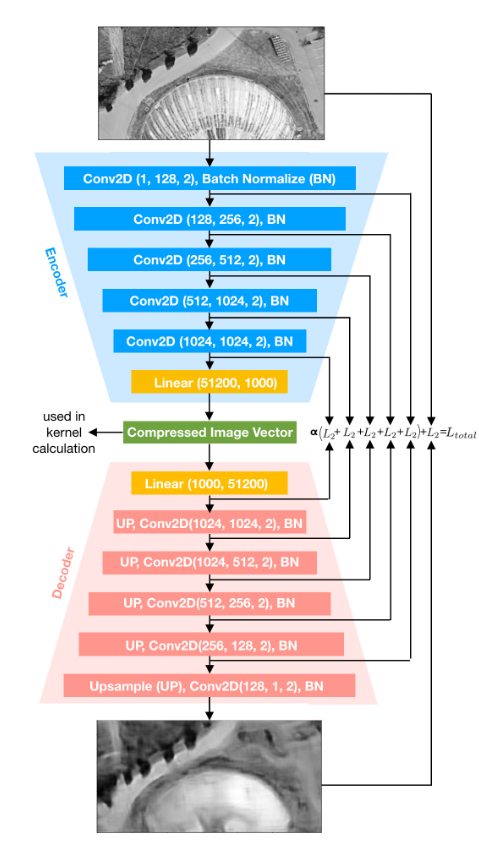
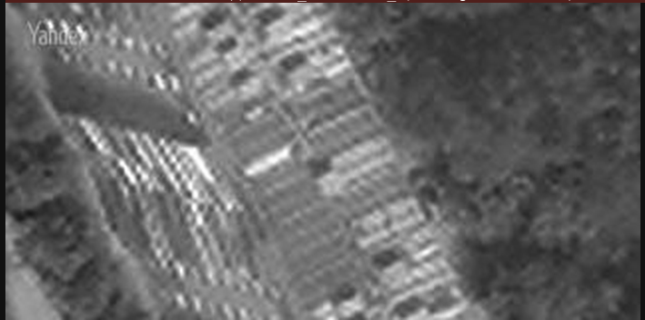
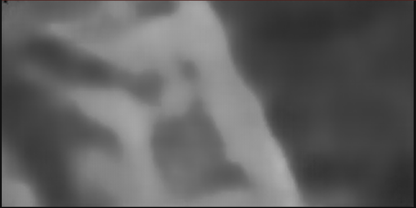

# AutoEncoder for UAV localization
## Paper

Autoencoder implementation from this [article](https://arxiv.org/pdf/2102.05692.pdf).

## Model architecture


## Training
```
epochs number = 10
```
input: 
output: 

## TODO
Variational autoencoder - [VAE](https://github.com/L1aoXingyu/pytorch-beginner/blob/9c86be785c7c318a09cf29112dd1f1a58613239b/08-AutoEncoder/Variational_autoencoder.py)
